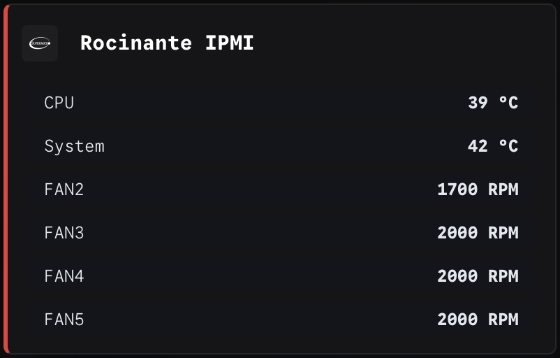

## IPMI Examples

The IPMI sensor statistics gets the values for the defined IPMI sensors as defined by it's configuration file, see [IPMI sensors configuration file](/config/ipmi_sensors.json).

For a description of the endpoint see [Unraid provider](/docs/IPMI.md).

An example Homepage widget for the Unraid stats could look like this;

```
- Rocinante IPMI:
    icon: /icons/supermicro-light.svg
    href: http://{{HOMEPAGE_VAR_IPMI_IP}}
    widget:
        type: customapi
        url: http://{{HOMEPAGE_VAR_ROCINANTE_IP}}:8383/ipmi/sensors?host={{HOMEPAGE_VAR_IPMI_IP}}&username={{HOMEPAGE_VAR_IPMI_USER}}&password={{HOMEPAGE_VAR_IPMI_PASSWORD}}
        refreshInterval: 1800000 #0,5 hour
        display: list
        mappings:
            - field: temperatures.cpu
            label: CPU
            suffix: " °C"
            - field: temperatures.system
            label: System
            suffix: " °C"
            - field: fans.fan2
            label: FAN2
            suffix: " RPM"
            - field: fans.fan3
            label: FAN3
            suffix: " RPM"
            - field: fans.fan4
            label: FAN4
            suffix: " RPM"
            - field: fans.fan5
            label: FAN5
            suffix: " RPM"
```



As shown in the widget example the input parameters are stored in an environment file and are as follows;
* `HOMEPAGE_VAR_IPMI_IP` = IP adress where IPMI interface can be reached
* `HOMEPAGE_VAR_IPMI_USER` = username for the IPMI  interface
* `HOMEPAGE_VAR_IPMI_PASSWORD` = password for the IPMI interface
