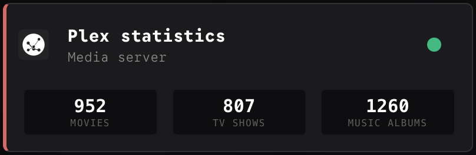
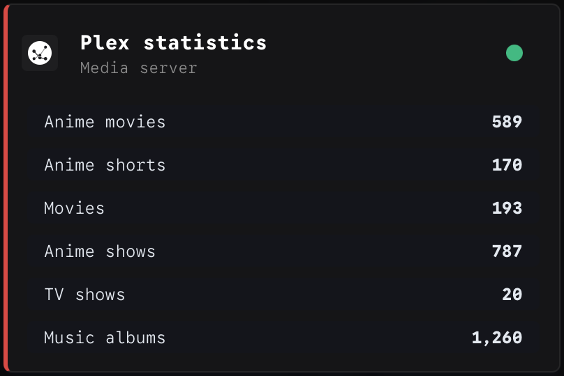

## Tautulli examples

Below are two examples for the Tautulli stats, one with aggregated stats and once without aggregation, meaning amount per library.

For a description of the endpoint see [Tautulli provider](/docs/TAUTULLI.md).

An example Homepage widget with `aggregate=on` for this endpoint could look like shown below. In fact the call can have the `aggegrate=on` omitted since the default behaviour is that the result is returned aggregated.

```
- Plex statistics:
	icon: /icons/tautulli-light.svg
	href: https://plex.{{HOMEPAGE_VAR_DOMAIN_NAME_AND_PORT}}
	description: Media server
	siteMonitor: https://{{HOMEPAGE_VAR_SERVER_IP}}:32400
	widgets:
	- type: customapi
	  url: http://{{HOMEPAGE_VAR_SERVER_IP}}:8383/tautulli/stats?aggegrate=on
	  refreshInterval: 21600000 #6 hours
	  display: block
	  mappings:
		- label: Movies
		  field: movies
		- label: TV Shows
		  field: tvshows
		- label: Music albums
		  field: albums
```



And an example with `aggregate=off` could look like shown below. In this case we use `display=list` instead of `display=block` as the block setting for display has a limit of 4 fields in a widget.

```
    - Plex statistics aggregate=off:
        icon: /icons/tautulli-light.svg
        href: https://plex.{{HOMEPAGE_VAR_DOMAIN_NAME_AND_PORT}}
        description: Media server
        siteMonitor: https://{{HOMEPAGE_VAR_SERVER_IP}}:32400
        widgets:
        - type: customapi
          url: http://{{HOMEPAGE_VAR_SERVER_IP}}:8383/tautulli/stats?aggregate=off
          refreshInterval: 21600000 #6 hours
          display: list
          mappings:
            - field: "movies.Anime movies.movies"
              label: Anime movies
              format: number
            - field: "movies.Anime shorts.movies"
              label: Anime shorts
              format: number
            - field: movies.Movies.movies
              label: Movies
              format: number
            - field: shows.Anime.shows
              label: Anime shows
              format: number
            - field: shows.TV Shows.shows   
              label: TV shows
              format: number
            - field: music.Music.albums
              label: Music albums
              format: number
```

