## Tracearr examples

Below are examples for the Tracearr endpoints. As you will see all these examples output a JSON array. Using a JSON array makes it easy to dynamically parse the output into a Homepage widget by using `display: dynamic-list` and then just use `name` and `label` to match the left and right side for the widget display.

For a description of all Tracearr endpoints see [Tracearr provider](/docs/TRACEARR.md).

### 1. Movie and TV episodes resolution endpoints

Two Homepage widgets for the `/tracearr/resolution/movies` and `/tracearr/resolution/tv` endpoints.
```
- Media resolution:
    - Movies:
        icon: /icons/mediastats/mediastats-resolution-movie-light.svg
        widget:
            type: customapi
            url: http://homepage-helpers:8383/tracearr/resolutions/movies
            refreshInterval: 21600000 #6 hours
            display: dynamic-list
            mappings:
                items: items
                name: resolution
                label: count
                format: number
    - Series:
        icon: /icons/mediastats/mediastats-resolution-tv-light.svg
        widget:
            type: customapi
            url: http://homepage-helpers:8383/tracearr/resolutions/tv
            refreshInterval: 21600000 #6 hours
            display: dynamic-list
            mappings:
                items: items
                name: resolution
                label: count
                format: number
```

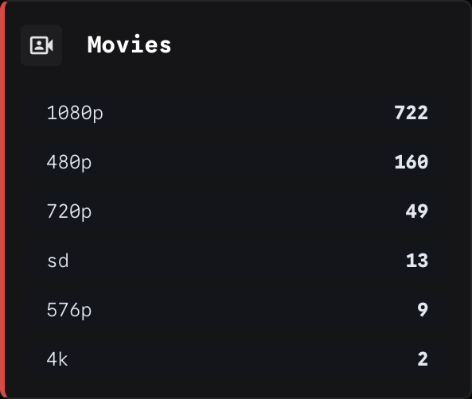
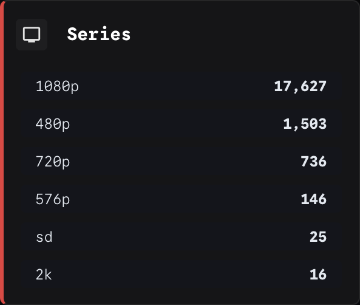

### 2. Codecs and audio channels endpoints

Examples for the four different codecs and audio channels endpoints;
* `/tracearr/video_codecs`
* `/tracearr/audio_codecs`
* `/tracearr/music_codecs`
* `/tracearr/audio_channels`
```
- Media codecs:
    - Video:
        icon: /icons/mediastats/media-codecs-video-light.svg
        widget:
            type: customapi
            url: http://homepage-helpers:8383/tracearr/video_codecs
            refreshInterval: 21600000 #6 hours
            display: dynamic-list
            mappings:
                items: items
                name: codec
                label: count
    - Audio:
        icon: /icons/mediastats/media-codecs-audio-light.svg
        widget:
            type: customapi
            url: http://homepage-helpers:8383/tracearr/audio_codecs
            refreshInterval: 21600000 #6 hours
            display: dynamic-list
            mappings:
                items: items
                name: codec
                label: count
                format: number
    - Channels:
        icon: /icons/mediastats/media-codecs-channels-light.svg
        widget:
            type: customapi
            url: http://homepage-helpers:8383/tracearr/audio_channels
            refreshInterval: 21600000 #6 hours
            display: dynamic-list
            mappings:
                items: items
                name: display
                label: count
                format: number
    - Music:
        icon: /icons/mediastats/media-codecs-music-light.svg
        widget:
            type: customapi
            url: http://homepage-helpers:8383/tracearr/music_codecs
            refreshInterval: 21600000 #6 hours
            display: dynamic-list
            mappings:
                items: items
                name: codec
                label: count
                format: number
```

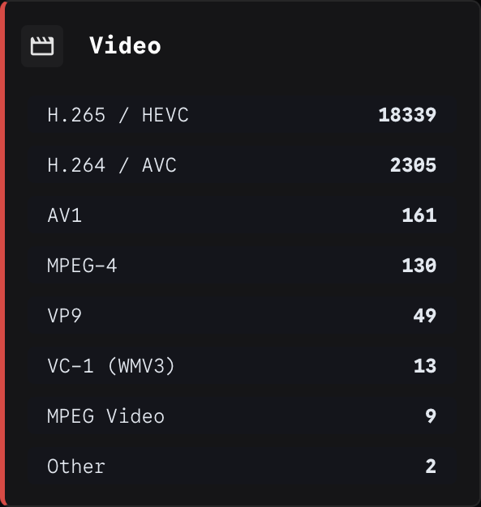
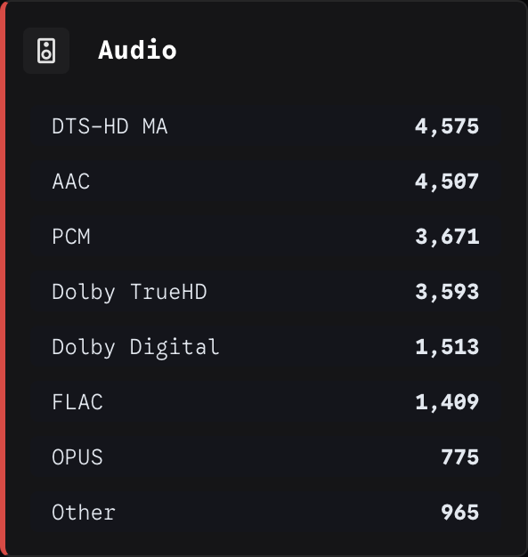
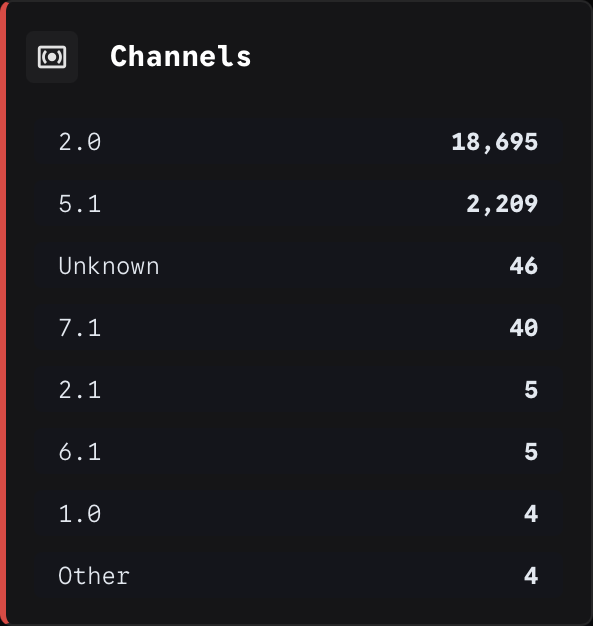
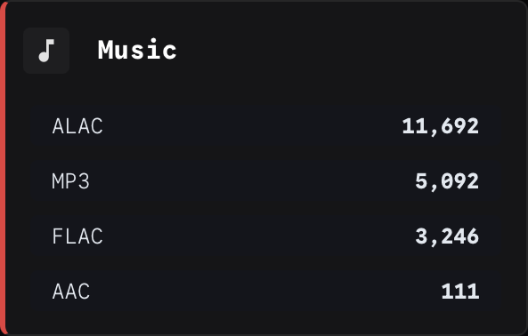

### 3. General statistics endpoint

Example Homepage widget for the `/tracearr/stats` endpoint.
```
- Media general:
    - General statistics:
        icon: /icons/mediastats/mediastats-history-light.svg
        widget:
            type: customapi
            url: http://homepage-helpers:8383/tracearr/stats
            refreshInterval: 21600000 #6 hours
            display: dynamic-list
            mappings:
                items: items
                name: label
                label: value
```

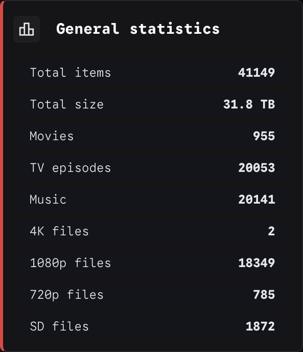

### 4. Historical statistic endpoints

Examples for the five historical endpoints;
* `/tracearr/history/stats`
* `/tracearr/history/users`
* `/tracearr/history/platforms`
* `/tracearr/history/devices`
* `/tracearr/history/countries`
```
- Historical data:
    - Watch statistics:
        icon: /icons/mediastats/mediastats-history-light.svg
        widget:
            type: customapi
            url: http://homepage-helpers:8383/tracearr/history/stats
            refreshInterval: 21600000 #6 hours
            display: dynamic-list
            mappings:
                items: items
                name: label
                label: value
    - Historical users:
        icon: /icons/mediastats/mediastats-history-light.svg
        widget:
            type: customapi
            url: http://homepage-helpers:8383/tracearr/history/users
            refreshInterval: 21600000 #6 hours
            display: dynamic-list
            mappings:
                items: items
                name: username
                label: count
    - Historical platforms:
        icon: /icons/mediastats/mediastats-history-light.svg
        widget:
            type: customapi
            url: http://homepage-helpers:8383/tracearr/history/platforms
            refreshInterval: 21600000 #6 hours
            display: dynamic-list
            mappings:
                items: items
                name: platform
                label: count
    - Historical devices:
        icon: /icons/mediastats/mediastats-history-light.svg
        widget:
            type: customapi
            url: http://homepage-helpers:8383/tracearr/history/devices
            refreshInterval: 21600000 #6 hours
            display: dynamic-list
            mappings:
                items: items
                name: device
                label: count
    - Historical countries:
        icon: /icons/mediastats/mediastats-history-light.svg
        widget:
            type: customapi
            url: http://homepage-helpers:8383/tracearr/history/countries
            refreshInterval: 21600000 #6 hours
            display: dynamic-list
            mappings:
                items: items
                name: country
                label: count
```

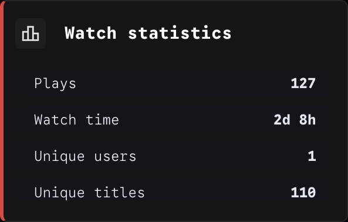
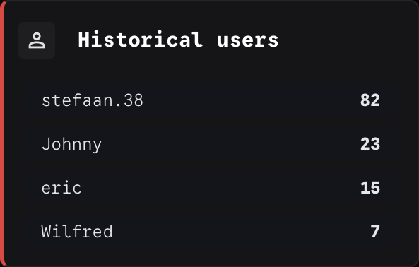
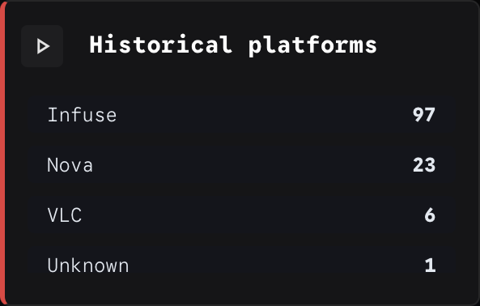
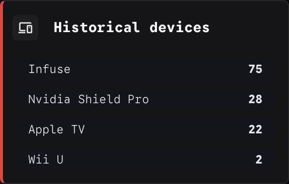
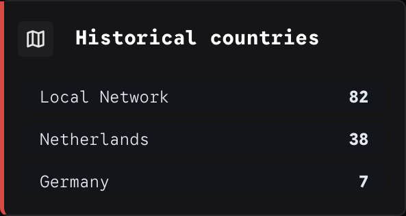