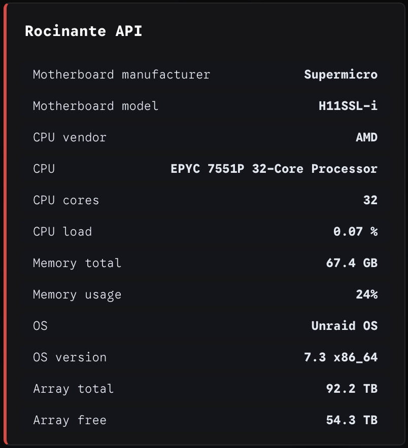
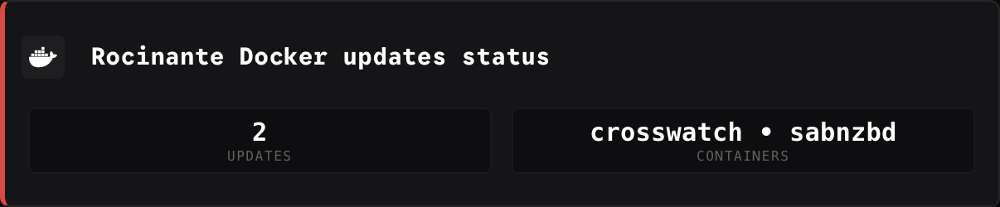

## Unraid Examples

### 1. Unraid stats

The Unraid stats gets various statistics for an Unraid server, configured in the [Unraid stats configuration file](/config/unraid_stats.json) configuration file.

For a description of the endpoint see [Unraid provider](/docs/UNRAID.md).

An example Homepage widget for the Unraid stats with the provided `/config/unraid_stats.json` configuration file, could look like this;

```
Rocinante API:
  widget:
  type: customapi
  url: http://{{HOMEPAGE_VAR_SERVER_IP}}:8383/unraid/stats
  refreshInterval: 300000 #5 minutes
  display: list
  mappings:
- field: data.info.baseboard.manufacturer
  label: Motherboard manufacturer
- field: data.info.baseboard.model
  label: Motherboard model
- field: data.info.cpu.vendor
  label: CPU vendor
- field: data.info.cpu.brand
  label: CPU
  format: text
- field: data.info.cpu.cores
  label: CPU cores
- field: data.metrics.cpu.percentTotal
  label: CPU load
  format: float
  scale: 0.01
  suffix: "%"
- field: data.metrics.memory.total
  label: Memory total
  format: bytes
- field: data.metrics.memory.percentTotal
  label: Memory usage
  format: percent
- field: data.info.os.distro
  label: OS
- field: data.info.os.release
  label: OS version
- field: data.array.capacity.kilobytes.total
  label: Array total
  format: bytes
  scale: 1024
- field: data.array.capacity.kilobytes.free
  label: Array free
  format: bytes
  scale: 1024
```



As shown in the widget example the input parameters are stored in an environment file and are as follows;
* `HOMEPAGE_VAR_SERVER_IP` = IP adress or FQDN for the server to query
* `HOMEPAGE_VAR_SERVER_API_KEY` = the Unraid API key
* `HOMEPAGE_VAR_SERVER_CSRF` = the Unraid CSRF token

### 2. Unraid updates

The Unraid updates gets the availble Docker containers updates for the server and also uses a configuration file, see [Unraid updates configuration file](/config/unraid_updates.json).

For a description of the endpoint see [Unraid provider](/docs/UNRAID.md).

An example Homepage widget for the Unraid stats could look like this;

```
- System:
    - Rocinante Docker updates status:
        icon: /icons/docker-light.svg
        widget:
          type: customapi
          url: http://{{HOMEPAGE_VAR_SERVER_IP}}:8383/unraid/updates
          refreshInterval: 3600000 #1 hour
          mappings:
            - field: count
              label: Updates
            - field: text
              label: Containers
```

